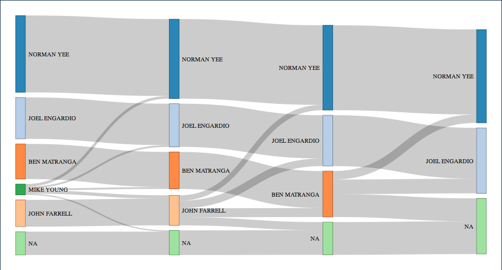

```{r setup, include=FALSE}
knitr::opts_chunk$set(echo = TRUE, cache = TRUE)
devtools::load_all(".")
library(dplyr)
library(networkD3)
library(alluvial)
```

# rcv
[](https://travis-ci.org/ds-elections/rcv)

`rcv` helps you work directly with raw ballot image and cast vote record data to tabulate and visualize ranked choice election results.

__Features__

* Read in ballot image and master lookup files
* Merge these files to get a "readable" ballot layout
* Conduct elections, and view a round-by-round table of results
* Visualize the flow of voters with an interactive Sankey diagram

__Installation__

We're on [CRAN](https://cran.r-project.org/package=rcv) now! You can install our latest release ([0.2.2](NEWS.md)):

```{r eval = F}
install.packages("rcv")
```

Or, you can install the development version of `rcv` here:

```{r eval = F}
devtools::install_github("ds-elections/rcv")
```

Created by:

- Jay Lee, jaylee@reed.edu
- Matthew Yancheff, yanchefm@reed.edu

The style of this README is inspired by the [googlesheets]("github.com/jennybc/googlesheets") R package.

## Basic Workflow Demo

`sf_bos_ballot` is included as an example raw ballot image, and `sf_bos_lookup` as an example raw master lookup. Both are included as `.rda`s, and they are in the "WinEDS" format. This data comes from the 2016 San Francisco Board of Supervisors elections ([San Francisco Department of Elections](http://www.sfelections.org/results/20161108/#english_detail)).

```{r}
head(sf_bos_ballot)
head(sf_bos_lookup)
```

#### Cleaning Data

The streamlined version of this process is done with the `clean_ballot()` function. `b_header` and `l_header` are logical values, based on whether the ballot and lookup file respectively have a header for the first row.

```{r}
cleaned <- clean_ballot(ballot = sf_bos_ballot, 
                        lookup = sf_bos_lookup, 
                        format = "WinEDS")
knitr::kable(head(readable(cleaned)))
```

To access intermediate steps, the following process can be used.

```{r}
# Import and label ballot image
a <- sf_bos_ballot %>%
    label(image = "ballot", format = "WinEDS")

# Import and label master lookup
b <- sf_bos_lookup %>%
    label(image = "lookup", format = "WinEDS")

# Merge these two tables
c <- characterize(ballot = a, lookup = b, format = "WinEDS")

knitr::kable(head(readable(c)))
```

The `readable()` function takes the clean image, which is formatted for ease in computation, and formats it to be easily read manually.

#### Running Elections

This is done with the `rcv_tally()` function. `sf_bos_clean` is included as an example of a pre-cleaned ballot using the functions above. We will run the District 1 election from this ballot image.

```{r}
results <- rcv_tally(sf_bos_clean, "Board of Supervisors, District 1")
knitr::kable(results)
```

Sandra Lee Fewer wins in Round 9, with 14,705 votes to Marjan Philhour's 13,126. 3,499 ballots were left blank for this election, and 3,779 were exhausted or marked invalid in this election.

#### Visualizing Data

We have two recommended methods of visualizing RCV data. Both utilize a flowchart called a "Sankey diagram" to show the transfer of voters between rounds. We will use each method to visualize the transfer of voters in the San Francisco District 7 Board of Supervisors election, because District 1 has too many crossings to be readable.

Method 1 (preferred because it is interactive, quicker, and more readable) uses the `networkD3` package:

```{r eval = F}
d3_7 <- rcv::make_d3list(results = sf_7_results)
networkD3::sankeyNetwork(Links = d3_7$values, Nodes = d3_7$names,
                         Source = "source", Target = "target",
                         Value = "value", NodeID = "candidate", units = "voters",
                         fontSize = 12, nodeWidth = 20)

```



Method 2 uses the `alluvial` package (this type of graphic is also called an alluvial diagram):

```{r}
alluvial_7 <- rcv::make_alluvialdf(image = sf_bos_clean,
                                   rcvcontest = "Board of Supervisors, District 7")
alluvial::alluvial(
  alluvial_7[,1:4], freq = alluvial_7$frequency,
  col = ifelse(alluvial_7$round4 == "NORMAN YEE", "lightgreen", "gray"),
  border = "gray", alpha = 0.7, blocks = TRUE
)
```
