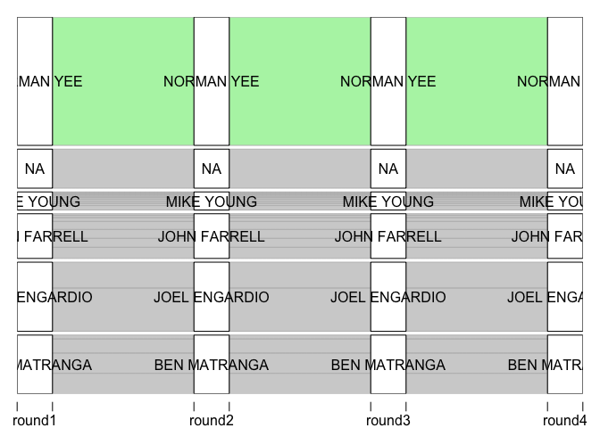

# rcv

[](https://travis-ci.org/jayleetx/rcv)

`rcv` helps you work directly with raw ballot image and cast vote record
data to tabulate and visualize ranked choice election results.

**Features**

  - Read in ballot image and master lookup files
  - Merge these files to get a “readable” ballot layout
  - Conduct elections, and view a round-by-round table of results
  - Visualize the flow of voters with an interactive Sankey diagram

**Installation**

We’re on [CRAN](https://cran.r-project.org/package=rcv) now\! You can
install our latest release ([0.2.2](NEWS.md)):

``` r
install.packages("rcv")
```

Or, you can install the development version of `rcv` here:

``` r
devtools::install_github("jayleetx/rcv")
```

Created by:

  - Jay Lee, <jaylee@reed.edu>
  - Matthew Yancheff, <yanchefm@reed.edu>

This package grew out a class project for Math 241 at Reed College,
taught by [Dr. Andrew Bray](http://andrewpbray.github.io/).

The style of this README is inspired by the
[googlesheets](%22github.com/jennybc/googlesheets%22) R package.

## Basic Workflow Demo

`sf_bos_ballot` is included as an example raw ballot image, and
`sf_bos_lookup` as an example raw master lookup. Both are included as
`.rda`s, and they are in the “WinEDS” format. This data comes from the
2016 San Francisco Board of Supervisors elections ([San Francisco
Department of
Elections](http://www.sfelections.org/results/20161108/#english_detail)).

``` r
head(sf_bos_ballot)
```

    ## # A tibble: 6 x 1
    ##   X1                                           
    ##   <chr>                                        
    ## 1 000000900000660300000010020000406001000012800
    ## 2 000000900000660300000010020000406002000000001
    ## 3 000000900000660300000010020000406003000000001
    ## 4 000000900000660400000010020000406001000012300
    ## 5 000000900000660400000010020000406002000012500
    ## 6 000000900000660400000010020000406003000012100

``` r
head(sf_bos_lookup)
```

    ## # A tibble: 6 x 1
    ##   X1                                                                       
    ##   <chr>                                                                    
    ## 1 Candidate 0000121SAMUEL KWONG                                      00000…
    ## 2 Candidate 0000131TIM E. DONNELLY                                   00000…
    ## 3 Candidate 0000133DEAN PRESTON                                      00000…
    ## 4 Candidate 0000135JOEL ENGARDIO                                     00000…
    ## 5 Candidate 0000140MELISSA SAN MIGUEL                                00000…
    ## 6 Candidate 0000144AHSHA SAFAI                                       00000…

#### Cleaning Data

The streamlined version of this process is done with the
`clean_ballot()` function. `b_header` and `l_header` are logical values,
based on whether the ballot and lookup file respectively have a header
for the first row.

``` r
cleaned <- clean_ballot(ballot = sf_bos_ballot, 
                        lookup = sf_bos_lookup, 
                        format = "WinEDS")
knitr::kable(head(readable(cleaned)))
```

| contest                          | pref\_voter\_id | 1                | 2                | 3                |
| :------------------------------- | :-------------- | :--------------- | :--------------- | :--------------- |
| Board of Supervisors, District 1 | 000006603       | SANDRA LEE FEWER | NA               | NA               |
| Board of Supervisors, District 1 | 000006604       | MARJAN PHILHOUR  | DAVID LEE        | SAMUEL KWONG     |
| Board of Supervisors, District 1 | 000006605       | DAVID LEE        | RICHIE GREENBERG | BRIAN J. LARKIN  |
| Board of Supervisors, District 1 | 000006606       | MARJAN PHILHOUR  | DAVID LEE        | SANDRA LEE FEWER |
| Board of Supervisors, District 1 | 000006607       | BRIAN J. LARKIN  | ANDY THORNLEY    | JASON JUNGREIS   |
| Board of Supervisors, District 1 | 000006608       | MARJAN PHILHOUR  | NA               | NA               |

To access intermediate steps, the following process can be used.

``` r
# Import and label ballot image
a <- sf_bos_ballot %>%
    label(image = "ballot", format = "WinEDS")

# Import and label master lookup
b <- sf_bos_lookup %>%
    label(image = "lookup", format = "WinEDS")

# Merge these two tables
c <- characterize(ballot = a, lookup = b, format = "WinEDS")

knitr::kable(head(readable(c)))
```

| contest                          | pref\_voter\_id | 1                | 2                | 3                |
| :------------------------------- | :-------------- | :--------------- | :--------------- | :--------------- |
| Board of Supervisors, District 1 | 000006603       | SANDRA LEE FEWER | NA               | NA               |
| Board of Supervisors, District 1 | 000006604       | MARJAN PHILHOUR  | DAVID LEE        | SAMUEL KWONG     |
| Board of Supervisors, District 1 | 000006605       | DAVID LEE        | RICHIE GREENBERG | BRIAN J. LARKIN  |
| Board of Supervisors, District 1 | 000006606       | MARJAN PHILHOUR  | DAVID LEE        | SANDRA LEE FEWER |
| Board of Supervisors, District 1 | 000006607       | BRIAN J. LARKIN  | ANDY THORNLEY    | JASON JUNGREIS   |
| Board of Supervisors, District 1 | 000006608       | MARJAN PHILHOUR  | NA               | NA               |

The `readable()` function takes the clean image, which is formatted for
ease in computation, and formats it to be easily read manually.

#### Running Elections

This is done with the `rcv_tally()` function. `sf_bos_clean` is included
as an example of a pre-cleaned ballot using the functions above. We will
run the District 1 election from this ballot image.

``` r
results <- rcv_tally(sf_bos_clean, "Board of Supervisors, District 1")
knitr::kable(results)
```

| candidate           | round1 | round2 | round3 | round4 | round5 | round6 | round7 | round8 | round9 | round10 | round11 | round12 | round13 | round14 | round15 | round16 | round17 | round18 | round19 | round20 | round21 | round22 | round23 | round24 | round25 | round26 | round27 |
| :------------------ | -----: | -----: | -----: | -----: | -----: | -----: | -----: | -----: | -----: | ------: | ------: | ------: | ------: | ------: | ------: | ------: | ------: | ------: | ------: | ------: | ------: | ------: | ------: | ------: | ------: | ------: | ------: |
| LONDON BREED        |  21318 |  21318 |  21318 |  21318 |  21318 |  21318 |  21318 |  21318 |  21318 |   21318 |   21318 |   21318 |   21318 |   21318 |   21318 |   21318 |   21318 |   21318 |   21318 |   21318 |   21318 |   21318 |   21318 |   30301 |   30301 |   30301 |   30301 |
| HILLARY RONEN       |  18335 |  18335 |  18460 |  18460 |  18460 |  18460 |  18460 |  18460 |  18460 |   18460 |   18460 |   18460 |   20166 |   20166 |   20166 |   20166 |   20166 |   20166 |   20166 |   25696 |   25696 |   25696 |   25696 |   25696 |   25696 |   25696 |   25696 |
| AARON PESKIN        |  19093 |  19093 |  19093 |  19093 |  19093 |  19093 |  19093 |  19093 |  19093 |   19093 |   19093 |   19093 |   19093 |   19093 |   19093 |   19093 |   22254 |   22254 |   22254 |   22254 |   22254 |   22254 |   22254 |   22254 |   22254 |   22254 |      NA |
| SANDRA LEE FEWER    |  12550 |  12689 |  12689 |  12777 |  12840 |  13029 |  13093 |  13225 |  13354 |   13354 |   13354 |   13354 |   13354 |   14705 |   14705 |   14705 |   14705 |   14705 |   14705 |   14705 |   14705 |   20074 |   20074 |   20074 |   20074 |      NA |      NA |
| NORMAN YEE          |  14154 |  14154 |  14154 |  14154 |  14154 |  14154 |  14154 |  14154 |  14154 |   14154 |   14644 |   14644 |   14644 |   14644 |   14644 |   15630 |   15630 |   17184 |   17184 |   17184 |   20038 |   20038 |   20038 |   20038 |      NA |      NA |      NA |
| DEAN PRESTON        |  19534 |  19534 |  19534 |  19534 |  19534 |  19534 |  19534 |  19534 |  19534 |   19534 |   19534 |   19534 |   19534 |   19534 |   19534 |   19534 |   19534 |   19534 |   19534 |   19534 |   19534 |   19534 |   19534 |      NA |      NA |      NA |      NA |
| AHSHA SAFAI         |   9422 |   9422 |   9422 |   9422 |   9422 |   9422 |   9422 |   9422 |   9422 |    9652 |    9652 |   10130 |   10130 |   10130 |   10895 |   10895 |   10895 |   10895 |   13984 |   13984 |   13984 |   13984 |      NA |      NA |      NA |      NA |      NA |
| MARJAN PHILHOUR     |  11067 |  11135 |  11135 |  11247 |  11348 |  11487 |  11680 |  11837 |  12086 |   12086 |   12086 |   12086 |   12086 |   13126 |   13126 |   13126 |   13126 |   13126 |   13126 |   13126 |   13126 |      NA |      NA |      NA |      NA |      NA |      NA |
| JOEL ENGARDIO       |   7630 |   7630 |   7630 |   7630 |   7630 |   7630 |   7630 |   7630 |   7630 |    7630 |    7960 |    7960 |    7960 |    7960 |    7960 |    9360 |    9360 |   12050 |   12050 |   12050 |      NA |      NA |      NA |      NA |      NA |      NA |      NA |
| JOSHUA ARCE         |   9612 |   9612 |   9722 |   9722 |   9722 |   9722 |   9722 |   9722 |   9722 |    9722 |    9722 |    9722 |   10911 |   10911 |   10911 |   10911 |   10911 |   10911 |   10911 |      NA |      NA |      NA |      NA |      NA |      NA |      NA |      NA |
| KIM ALVARENGA       |   8640 |   8640 |   8640 |   8640 |   8640 |   8640 |   8640 |   8640 |   8640 |    8931 |    8931 |    9633 |    9633 |    9633 |   10445 |   10445 |   10445 |   10445 |      NA |      NA |      NA |      NA |      NA |      NA |      NA |      NA |      NA |
| BEN MATRANGA        |   6475 |   6475 |   6475 |   6475 |   6475 |   6475 |   6475 |   6475 |   6475 |    6475 |    6809 |    6809 |    6809 |    6809 |    6809 |    8462 |    8462 |      NA |      NA |      NA |      NA |      NA |      NA |      NA |      NA |      NA |      NA |
| TIM E. DONNELLY     |   7395 |   7395 |   7395 |   7395 |   7395 |   7395 |   7395 |   7395 |   7395 |    7395 |    7395 |    7395 |    7395 |    7395 |    7395 |    7395 |      NA |      NA |      NA |      NA |      NA |      NA |      NA |      NA |      NA |      NA |      NA |
| JOHN FARRELL        |   4927 |   4927 |   4927 |   4927 |   4927 |   4927 |   4927 |   4927 |   4927 |    4927 |    5534 |    5534 |    5534 |    5534 |    5534 |      NA |      NA |      NA |      NA |      NA |      NA |      NA |      NA |      NA |      NA |      NA |      NA |
| MAGDALENA DE GUZMAN |   3001 |   3001 |   3001 |   3001 |   3001 |   3001 |   3001 |   3001 |   3001 |    3477 |    3477 |    4450 |    4450 |    4450 |      NA |      NA |      NA |      NA |      NA |      NA |      NA |      NA |      NA |      NA |      NA |      NA |      NA |
| DAVID LEE           |   3396 |   3408 |   3408 |   3488 |   3551 |   3622 |   3857 |   3961 |   4093 |    4093 |    4093 |    4093 |    4093 |      NA |      NA |      NA |      NA |      NA |      NA |      NA |      NA |      NA |      NA |      NA |      NA |      NA |      NA |
| MELISSA SAN MIGUEL  |   3439 |   3439 |   3640 |   3640 |   3640 |   3640 |   3640 |   3640 |   3640 |    3640 |    3640 |    3640 |      NA |      NA |      NA |      NA |      NA |      NA |      NA |      NA |      NA |      NA |      NA |      NA |      NA |      NA |      NA |
| FRANCISCO HERRERA   |   2598 |   2598 |   2598 |   2598 |   2598 |   2598 |   2598 |   2598 |   2598 |    3037 |    3037 |      NA |      NA |      NA |      NA |      NA |      NA |      NA |      NA |      NA |      NA |      NA |      NA |      NA |      NA |      NA |      NA |
| MIKE YOUNG          |   1995 |   1995 |   1995 |   1995 |   1995 |   1995 |   1995 |   1995 |   1995 |    1995 |      NA |      NA |      NA |      NA |      NA |      NA |      NA |      NA |      NA |      NA |      NA |      NA |      NA |      NA |      NA |      NA |      NA |
| BERTA HERNANDEZ     |   1599 |   1599 |   1599 |   1599 |   1599 |   1599 |   1599 |   1599 |   1599 |      NA |      NA |      NA |      NA |      NA |      NA |      NA |      NA |      NA |      NA |      NA |      NA |      NA |      NA |      NA |      NA |      NA |      NA |
| RICHIE GREENBERG    |    974 |    984 |    984 |   1042 |   1220 |   1272 |   1386 |   1508 |     NA |      NA |      NA |      NA |      NA |      NA |      NA |      NA |      NA |      NA |      NA |      NA |      NA |      NA |      NA |      NA |      NA |      NA |      NA |
| BRIAN J. LARKIN     |    747 |    773 |    773 |    832 |    896 |    956 |    997 |     NA |     NA |      NA |      NA |      NA |      NA |      NA |      NA |      NA |      NA |      NA |      NA |      NA |      NA |      NA |      NA |      NA |      NA |      NA |      NA |
| SAMUEL KWONG        |    740 |    744 |    744 |    760 |    785 |    814 |     NA |     NA |     NA |      NA |      NA |      NA |      NA |      NA |      NA |      NA |      NA |      NA |      NA |      NA |      NA |      NA |      NA |      NA |      NA |      NA |      NA |
| JONATHAN LYENS      |    609 |    652 |    652 |    679 |    726 |     NA |     NA |     NA |     NA |      NA |      NA |      NA |      NA |      NA |      NA |      NA |      NA |      NA |      NA |      NA |      NA |      NA |      NA |      NA |      NA |      NA |      NA |
| JASON JUNGREIS      |    611 |    626 |    626 |    654 |     NA |     NA |     NA |     NA |     NA |      NA |      NA |      NA |      NA |      NA |      NA |      NA |      NA |      NA |      NA |      NA |      NA |      NA |      NA |      NA |      NA |      NA |      NA |
| SHERMAN R. D’SILVA  |    557 |    566 |    566 |     NA |     NA |     NA |     NA |     NA |     NA |      NA |      NA |      NA |      NA |      NA |      NA |      NA |      NA |      NA |      NA |      NA |      NA |      NA |      NA |      NA |      NA |      NA |      NA |
| ISWARI ESPAÑA       |    539 |    539 |     NA |     NA |     NA |     NA |     NA |     NA |     NA |      NA |      NA |      NA |      NA |      NA |      NA |      NA |      NA |      NA |      NA |      NA |      NA |      NA |      NA |      NA |      NA |      NA |      NA |
| ANDY THORNLEY       |    359 |     NA |     NA |     NA |     NA |     NA |     NA |     NA |     NA |      NA |      NA |      NA |      NA |      NA |      NA |      NA |      NA |      NA |      NA |      NA |      NA |      NA |      NA |      NA |      NA |      NA |      NA |
| NA                  |  23286 |  23319 |  23422 |  23520 |  23633 |  23819 |  23986 |  24468 |  25466 |   25629 |   25863 |   26747 |   27492 |   29194 |   32067 |   33562 |   37796 |   42014 |   49370 |   54751 |   63947 |   71704 |   85688 |   96239 |  116277 |  136351 |  158605 |

Sandra Lee Fewer wins in Round 9, with 14,705 votes to Marjan Philhour’s
13,126. 3,499 ballots were left blank for this election, and 3,779 were
exhausted or marked invalid in this election.

#### Visualizing Data

We have two recommended methods of visualizing RCV data. Both utilize a
flowchart called a “Sankey diagram” to show the transfer of voters
between rounds. We will use each method to visualize the transfer of
voters in the San Francisco District 7 Board of Supervisors election,
because District 1 has too many crossings to be readable.

Method 1 (preferred because it is interactive, quicker, and more
readable) uses the `networkD3` package:

``` r
d3_7 <- rcv::make_d3list(results = sf_7_results)
networkD3::sankeyNetwork(Links = d3_7$values, Nodes = d3_7$names,
                         Source = "source", Target = "target",
                         Value = "value", NodeID = "candidate", units = "voters",
                         fontSize = 12, nodeWidth = 20)
```


Method 2 uses the `alluvial` package (this type of graphic is also
called an alluvial diagram):

``` r
alluvial_7 <- rcv::make_alluvialdf(image = sf_bos_clean,
                                   rcvcontest = "Board of Supervisors, District 7")
alluvial::alluvial(
  alluvial_7[,1:4], freq = alluvial_7$frequency,
  col = ifelse(alluvial_7$round4 == "NORMAN YEE", "lightgreen", "gray"),
  border = "gray", alpha = 0.7, blocks = TRUE
)
```

<!-- -->
